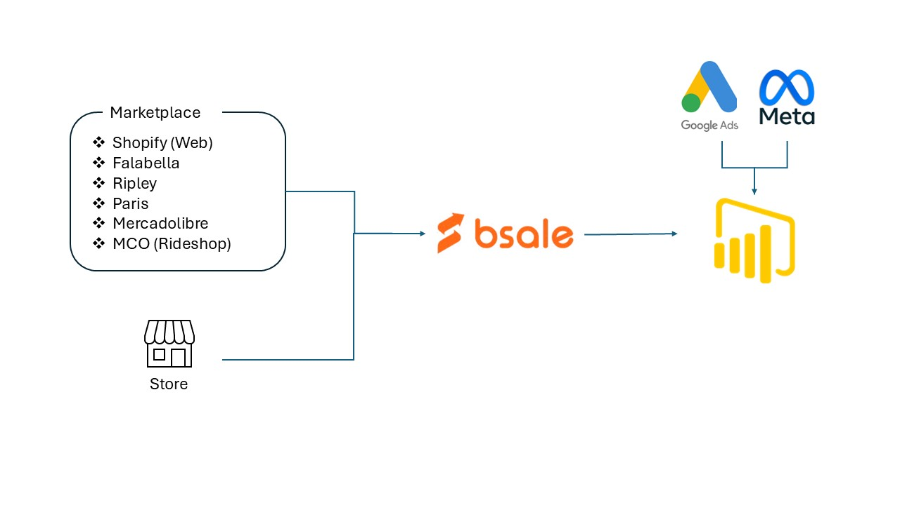
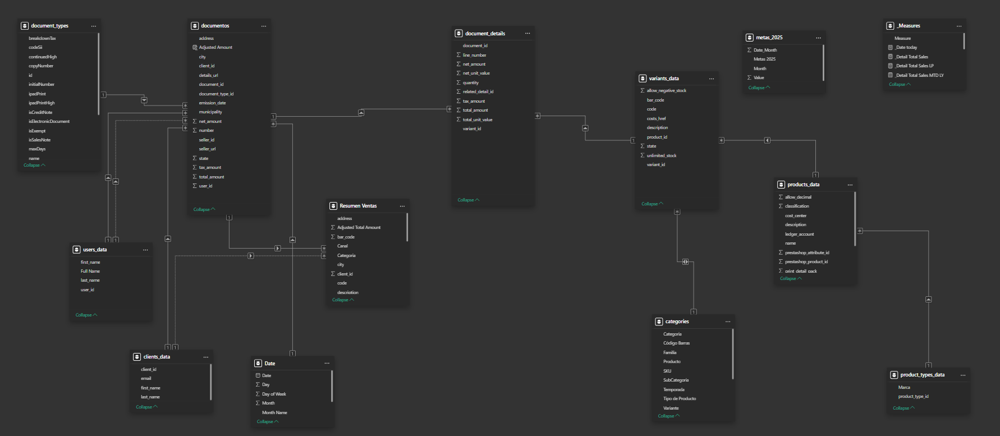

# Sales Dashboard for Sporting Goods

## Project Objective

The objective of this project is to create a **complete dashboard** for a sporting goods company. This company manages sales through various channels, both physical and digital. The dashboard will consolidate data from different sources to provide a comprehensive view of the company's sales and inventory.

## Data Sources

The company obtains sales and stock data from various sources:

1. **In-store sales**: Sales data from the physical store is managed directly through the **ERP Bsale**, which also serves as the POS system.
2. **Online sales**:
   - **Marketplaces**: The company sells through the following marketplaces: **Mercadolibre**, **Falabella**, **Ripley**, **Paris**, **MCO (Rideshop)**, and **Shopify** (Store web). These marketplaces inject sales and stock data directly into the **ERP Bsale**.
3. **Online Marketing**: The data from advertising campaigns does not get injected into the ERP but is obtained directly from the online marketing platforms:
   - **Google Ads**
   - **Meta (Facebook, Instagram)**

## ERP and Marketplace Integration

The company uses the **ERP Bsale** as the system to manage sales and stock. This ERP is directly connected to the marketplaces and the store's POS system, allowing for continuous updates of sales and stock data.

## Information Flow Diagram

The following diagram illustrates the flow of information between the different systems:

- **In-store sales**: Directly recorded in the ERP Bsale.
- **Online sales from Marketplace (Mercadolibre, Falabella, Ripley, Paris, MCO)**: Sales and stock data are injected directly into the ERP Bsale.
- **Online Marketing (Google Ads and Meta)**: Campaign data is obtained directly from the marketing platforms and is not injected into the ERP.



## Step 1: GitHub Repository

The first step was to create a **GitHub repository** to maintain version control and back up all the code. This ensures that all code changes are tracked and that we have a secure and organized environment to store the project files.

## Repository Structure

The repository is organized as follows:

- **.venv**: This folder contains the virtual environment for the project. It isolates the dependencies and ensures that the project runs with the correct versions of packages.
- **config**: This folder holds configuration files that are used for setting up environment variables and other necessary settings for the project.
- **data**: This folder stores the data files, including the documents and details files that are downloaded and processed.
- **images**: This folder contains images used in the project, such as flowcharts and other visual aids for the documentation.
- **scripts**: This folder contains the Python scripts that download, process, and analyze the data from Bsale and other sources.
- **pbix**: This folder holds Power BI files used for creating the dashboard visualizations.
- **requirements**: This file lists all the dependencies required for the project. It is used to install the necessary Python packages for the project.
- **main.py**: This is the main Python file that executes the core logic of the project, including the data fetching and processing.
- **README**: This file provides documentation and details about the project, including setup instructions, usage, and the objectives of the dashboard.
  
## Step 2: Getting Data from Bsale

The first challenge was to obtain data from the **Bsale API**. Bsale is an ERP (Enterprise Resource Planning) system used for managing inventory, sales, and other business operations. To start integrating with Bsale, we followed the **Bsale First Steps** guide, which provided the necessary API authentication process and instructions for making requests to the API.

### Key Concepts:
- **Authentication**: The Bsale API requires an API token for access, which is used for authentication in requests.
- **Endpoints**: Various endpoints allow fetching different types of data such as documents, clients, products, and sales.
- **Response Format**: Data is returned in JSON format, which is processed using Python scripts to extract and transform the information.
  
You can find more detailed documentation on getting started with the Bsale API [here](https://docs.bsale.dev/CL/first-steps).

## Step 3: Downloading Documents from Bsale

The first challenge was to obtain documents from **Bsale** via their API. The **Bsale API** provides endpoints for retrieving sales data from the ERP system, which integrates with multiple sources such as physical stores, online stores (Shopify, marketplaces), and more.

### Bsale API Overview:
- The **Bsale API** provides access to various types of data, including documents, clients, products, and more. For this project, we focus on the **/documents** endpoint to fetch sales records.
- To interact with the API, we need an **API token** for authentication.

### Key Steps:
1. **Obtain API Token**:
   - The **API token** is loaded from an `.env` file using the `dotenv` library to authenticate requests to the Bsale API.

2. **Date Range Selection**:
   - We use **Tkinter** and **tkcalendar** to present the user with a calendar interface to select the start and end dates for downloading the documents.

3. **Convert Dates to Unix Timestamps**:
   - The selected start and end dates are converted into **Unix timestamps** (the number of seconds since January 1st, 1970). These timestamps are then used as parameters for the API query.

4. **Download Documents**:
   - A **GET** request is made to the **/v1/documents.json** endpoint with the **emissiondaterange** parameter. This filters documents based on the date range (converted to Unix timestamps).
   - The request is paginated to retrieve all available documents. If there are more than 50 documents, the `offset` parameter is used to fetch the next batch of documents.

5. **Seller Information**:
   - Each document includes a **sellers** field with a **href** URL. This URL points to the seller's details. We extract the seller’s **ID** using this URL.

6. **Save Documents to CSV**:
   - After fetching the documents, the data is saved to a CSV file. This file is then appended to the existing global documents CSV file for further analysis.

### Code Functionality:
1. **Tkinter Date Picker**: This allows the user to select the start and end dates for the document range.
2. **Date Conversion**: The selected dates are converted into Unix timestamps to be used in the API request.
3. **API Request**: A GET request is made to fetch documents within the specified date range using the `emissiondaterange` filter.
4. **Pagination Handling**: If there are more than 50 documents, multiple requests are made to retrieve the full set of documents.
5. **Seller Information**: The seller’s ID is fetched by accessing the seller’s URL from each document’s response.
6. **Save to CSV**: The downloaded documents are saved in CSV format and appended to the global documents CSV file.

The downloaded data is stored in the **`data/documentos/`** directory for further use in the dashboard.

You can check the script in the [scripts/download_documents.py](scripts/download_documents.py).

## Step 4: Downloading Document Details from Bsale

After obtaining the main documents, the next step is to download the detailed information for each document. This includes details about the products in each document, such as the quantity, unit values, net amount, tax amount, and total amount.

### Bsale API for Document Details:
- The **Bsale API** provides an endpoint for retrieving detailed information about the products in a specific document. The details are stored in the `details_url` field of each document record.
- The API call for document details returns a JSON response with information such as:
  - Line number
  - Quantity
  - Unit values (net and total)
  - Net amount and tax amount
  - Variant ID (if applicable)
  - Related detail ID

### Script for Downloading Document Details:
1. The script first loads the document information from the `documentos.csv` file (which contains document metadata, including the `details_url`).
2. For each document, the `details_url` is extracted, and a request is made to fetch the product details.
3. The details for each product are parsed and added to a new list, which is then saved as a **CSV file** named `document_details.csv`.

### Key Functions:
- **Iterate through each document** in the `documentos.csv` file.
- **Fetch product details** using the URL in the `details_url` field.
- **Save the details** to a new CSV file, `document_details.csv`, which contains the following columns:
  - `document_id`
  - `line_number`
  - `quantity`
  - `net_unit_value`
  - `total_unit_value`
  - `net_amount`
  - `tax_amount`
  - `total_amount`
  - `variant_id`
  - `related_detail_id`

The **script** to download document details is stored in the `scripts/document_details.py` file.

### Example Code:
````python
import requests
import pandas as pd
from dotenv import load_dotenv
import os
import time

# === Load the API Token from .env ===
load_dotenv(dotenv_path="config/.env")
ACCESS_TOKEN = os.getenv("BSALE_ACCESS_TOKEN")

# === Path to the 'documentos.csv' file ===
documents_file_path = "C:/Users/celto/OneDrive - Personal/OneDrive/Data/Github/skinautica-bsale-powerbi/data/documentos/documentos.csv"

# Read the documents data from the CSV file
documents_df = pd.read_csv(documents_file_path)

# === Extract the details_url and Fetch Details ===
document_details_data = []

for index, row in documents_df.iterrows():
    details_url = row['details_url']
    
    if details_url:
        response = requests.get(details_url, headers={"access_token": ACCESS_TOKEN})
        
        if response.status_code == 200:
            details_data = response.json()
            
            for item in details_data.get("items", []):
                document_detail = {
                    "document_id": row["document_id"], 
                    "line_number": item.get("lineNumber"),
                    "quantity": item.get("quantity"),
                    "net_unit_value": item.get("netUnitValue"),
                    "total_unit_value": item.get("totalUnitValue"),
                    "net_amount": item.get("netAmount"),
                    "tax_amount": item.get("taxAmount"),
                    "total_amount": item.get("totalAmount"),
                    "variant_id": item.get("variant", {}).get("id"),
                    "related_detail_id": item.get("relatedDetailId")
                }
                document_details_data.append(document_detail)

# === Save Data to CSV ===
if document_details_data:
    output_dir = "C:/Users/celto/OneDrive - Personal/OneDrive/Data/Github/skinautica-bsale-powerbi/data/document_details/"
    os.makedirs(output_dir, exist_ok=True)
    
    details_file_path = os.path.join(output_dir, "document_details.csv")
    details_df = pd.DataFrame(document_details_data)
    details_df.to_csv(details_file_path, index=False)
    
    print(f"✅ {len(details_df)} document details saved to '{details_file_path}'")
else:
    print("⚠️ No document details found.")
````

### Output:

- The data is saved in the **`data/document_details/`** directory.

- The file `document_details.csv` is appended with new data from the latest document details.

This **document details** table, along with the **documents** table, represents the fact tables used for analysis in the **Power BI** dashboard.

## Step 5: Download Dimension Tables

In addition to downloading the transactional data (documents and document details), we also need to download the **dimension tables** to enrich the analysis and enhance the report structure. The following dimension tables were downloaded from the Bsale API: **Clients**, **Products**, **Product Types**, **Users**, and **Variants**.

#### 1. **Clients**
The **Clients** table contains the essential client information, such as:
- **Client ID**: A unique identifier for the client.
- **First Name**: The client's first name.
- **Last Name**: The client's last name.
- **Email**: The client's email address.

The **`clientes.py`** script downloads the client data using the Bsale API and saves it as a CSV file in the **`data/clients/`** directory.

#### 2. **Products**
The **Products** table holds the details of each product sold, such as:
- **Product ID**: Unique identifier for the product.
- **Product Name**: The name of the product.
- **Description**: The product description.
- **Price**: The price of the product.
- **Stock Control**: Information on whether stock is controlled.

The **`productos.py`** script downloads the product data from Bsale and stores it in the **`data/products/`** directory.

#### 3. **Product Types**
The **Product Types** table provides the categorization of each product:
- **Product Type ID**: A unique identifier for the product type.
- **Name**: The name of the product type (e.g., "Sports Equipment", "Apparel").
- **State**: The current state of the product type.

The **`product_type.py`** script is responsible for downloading product types and saving them as a CSV file in the **`data/product_types/`** directory.

#### 4. **Users**
The **Users** table contains data on the users associated with the documents:
- **User ID**: Unique identifier for each user.
- **First Name**: The first name of the user.
- **Last Name**: The last name of the user.

The **`usuarios.py`** script downloads user information from Bsale and saves it to the **`data/users/`** directory.

#### 5. **Variants**
The **Variants** table contains detailed information about product variants:
- **Variant ID**: Unique identifier for the product variant.
- **Description**: The description of the variant.
- **Product ID**: The product ID associated with the variant.
- **Stock and Pricing Information**: Details on the stock levels and costs associated with the variant.

The **`variantes.py`** script downloads the variant information and stores it in the **`data/variants/`** directory.

### Summary of the Data Pipeline for Dimension Tables
- **Data Collection**: Information is collected from Bsale using various API endpoints.
- **Data Storage**: Each dimension table is stored as a CSV file in a dedicated folder within the `data/` directory.
- **Data Usage**: The data from these dimension tables is used to enrich the transactional data, enabling more detailed analysis in the dashboard.

### Example of Code to Download Clients (clientes.py)

```python
import requests
import pandas as pd
from dotenv import load_dotenv
import os

# === Load API Token ===
load_dotenv(dotenv_path="config/.env")
ACCESS_TOKEN = os.getenv("BSALE_ACCESS_TOKEN")

# === API Configuration ===
BASE_URL = "https://api.bsale.cl/v1/clients.json"

# Parameters for the API request (pagination)
params = {
    "limit": 50,  # Limit of clients per request
    "offset": 0   # Starting point for pagination
}

headers = {
    "access_token": ACCESS_TOKEN
}

# === Download Client Data ===
client_data = []
print("🔄 Downloading clients...")

while True:
    response = requests.get(BASE_URL, headers=headers, params=params)
    
    # Check if the request was successful
    if response.status_code != 200:
        print(f"❌ Error: {response.status_code}, {response.text}")
        break

    data = response.json()
    clients = data.get("items", [])
    
    if not clients:
        break

    for client in clients:
        # Extract only the necessary client data
        client_info = {
            "client_id": client.get("id"),
            "first_name": client.get("firstName"),
            "last_name": client.get("lastName"),
            "email": client.get("email"),
        }
        client_data.append(client_info)

    # Update the offset for pagination
    params["offset"] += params["limit"]

# === Save Data to CSV ===
if client_data:
    output_dir = "data/clients/"
    os.makedirs(output_dir, exist_ok=True)

    filename = "clients_data.csv"
    filepath = os.path.join(output_dir, filename)

    # Save to CSV
    df = pd.DataFrame(client_data)
    df.to_csv(filepath, index=False)

    print(f"✅ {len(df)} client records saved to '{filepath}'")
else:
    print("⚠️ No clients found.")
````
**Note**: Similar scripts were created for **Products**, **Product Types**, **Users**, and **Variants**, and they all follow the same structure for downloading data from Bsale and saving them into separate CSV files.

## Step 6: Update Fact Tables (Documents and Document Details)

#### **Objective**:
This script is designed to update the **fact tables** (`documentos.csv` and `document_details.csv`) by downloading new documents and their details from the Bsale API, appending them to the existing files.

#### **How It Works**:
1. **Download New Documents**:
   - The script calculates the date range (from the last saved document date to the previous day).
   - It fetches documents from the Bsale API, extracting essential details like document ID, emission date, total amount, client, etc.
   - The new documents are appended to the `documentos.csv` file.

2. **Download Document Details**:
   - For each downloaded document, the script retrieves detailed information about each item (e.g., quantity, net unit value, tax amount).
   - These details are saved in the `document_details.csv` file.
   
3. **Output**:
   - Both the documents and their details are updated in their respective CSV files.
   - The script also prints the number of records processed and provides a preview of the first 5 rows for verification.

#### **Files**:
- `update_documents.py` – Located in the `/scripts` folder.

---

This script ensures that the fact tables are up to date by regularly fetching new data from Bsale and appending it to the existing CSV files.


## Step 7: Data Schema Overview

The data model for this project consists of both **fact tables** and **dimension tables**. The **fact tables** are:

1. **Document Table** (`documentos.csv`): Contains records of each document (e.g., invoices, receipts, etc.) with detailed transactional information like amounts and taxes.
2. **Document Details Table** (`document_details.csv`): Contains detailed information for each line item in the documents (e.g., product quantity, variant details).

The **dimension tables** provide more context to the data in the fact tables. These are:

- **Categories Table** (`categories`): Classifies the products based on various attributes like season (summer, winter), family, category, and subcategory.
- **Users Table** (`users_data`): Information about the users, such as their first name, last name, and user ID.
- **Clients Table** (`client_data`): Details of the clients, including client ID, name, and email.
- **Product Types Table** (`product_types_data`): Contains types of products, like "electronics", "clothing", etc.
- **Products Table** (`products_data`): Detailed information about the products, including classification, description, and various identifiers.
- **Date Table** (`Date`): A table used to categorize data by date, allowing time-based analysis and measures.
- **Metas Table** (`metas_2025`): Contains the targets or goals for 2025, useful for benchmarking.
- **Measures Table** (`Measures`): Used to store calculated measures such as sales totals.

### Screenshot of the Schema

Here is the schema of the data model for the dashboard, showing how all tables are connected:



### Relationships Between Tables

- **Document Types** are connected to **Documents**, with the relationship being based on `document_type_id`.
- **Documents** are connected to **Document Details**, where the document ID serves as the key to connect individual items of each document.
- **Product Data** is related to **Variants**, and **Variants** are further linked to **Categories**, which classify products into various attributes such as seasonality and family.
- **Clients** and **Users** provide information about the people involved in the transactions, which are linked to the documents.
- The **Date** table is connected to the other tables using the `emission_date`, ensuring that time-based analysis is possible.

## Step 8: Connection to Shopify and Data Download

After completing the data extraction from Bsale, we moved on to connect with Shopify to gather online sales data from the Shopify store. This process involves using Shopify's GraphQL API to fetch order details, such as the total sales amount, number of orders, and other related information. The following steps outline how this was achieved:

### **Shopify API Setup**:
- We use Shopify's GraphQL API to query for order data.
- The API is accessed by sending HTTP POST requests to the endpoint: `https://{SHOPIFY_STORE}/admin/api/2024-01/graphql.json`.
- Access to the API is secured using an access token (`SHOPIFY_ACCESS_TOKEN`) that is stored in the `.env` file.

### **Query Structure**:
- The API query is constructed dynamically to include pagination, fetching the latest orders within a given date range (in this case, starting from January 1, 2023).
- We filter out test orders and cancelled orders, focusing only on real transactions.

### **Data Processing**:
- The response from Shopify contains orders, including the total price of each order.
- The data is processed to calculate the total sales amount for each day and the total number of orders.
- We ensure that the data is in the correct timezone for Chile (`America/Santiago`), and then we accumulate sales per day.

### **Saving the Data**:
- The processed sales data is stored in a DataFrame and then exported to a CSV file.
- The CSV file is saved in the `data/shopify_sales/` directory, and it's named `ventas_shopify.csv`.

Here’s the script used to download the Shopify sales data and store it in a CSV file:

```python
import requests
import json
import os
from dotenv import load_dotenv
from datetime import datetime
from zoneinfo import ZoneInfo
import pandas as pd
from collections import defaultdict

# Load credentials
load_dotenv(dotenv_path="config/.env")
SHOPIFY_STORE = os.getenv("SHOPIFY_STORE")
ACCESS_TOKEN = os.getenv("SHOPIFY_ACCESS_TOKEN")
url = f"https://{SHOPIFY_STORE}/admin/api/2024-01/graphql.json"

headers = {
    "Content-Type": "application/json",
    "X-Shopify-Access-Token": ACCESS_TOKEN
}

# Template for paginated query with date filter
def build_query(cursor=None):
    cursor_clause = f', after: "{cursor}"' if cursor else ""
    return f"""
    {{
      orders(first: 100{cursor_clause}, query: "created_at:>=2023-01-01") {{
        pageInfo {{
          hasNextPage
          endCursor
        }}
        edges {{
          node {{
            createdAt
            cancelReason
            test
            currentTotalPriceSet {{
              shopMoney {{
                amount
                currencyCode
              }}
            }}
          }}
        }}
      }}
    }}
    """

# Initialize structures
ventas_por_dia = defaultdict(float)
ordenes_por_dia = defaultdict(int)

# Get all orders with pagination
has_next_page = True
cursor = None
total_ordenes = 0

while has_next_page:
    query = build_query(cursor)
    response = requests.post(url, headers=headers, json={"query": query})
    res_data = response.json()

    if "errors" in res_data:
        print("❌ Error en consulta GraphQL:")
        print(json.dumps(res_data, indent=2))
        break

    orders_data = res_data["data"]["orders"]
    for order in orders_data["edges"]:
        nodo = order["node"]

        if nodo["test"] or nodo["cancelReason"] is not None:
            continue

        monto_venta = float(nodo["currentTotalPriceSet"]["shopMoney"]["amount"])
        if monto_venta == 0:
            continue

        created_utc = datetime.fromisoformat(nodo["createdAt"].replace("Z", "")).replace(tzinfo=ZoneInfo("UTC"))
        created_cl = created_utc.astimezone(ZoneInfo("America/Santiago"))
        fecha_solo = created_cl.date()

        ventas_por_dia[fecha_solo] += monto_venta
        ordenes_por_dia[fecha_solo] += 1
        total_ordenes += 1

    # Move to next page
    has_next_page = orders_data["pageInfo"]["hasNextPage"]
    cursor = orders_data["pageInfo"]["endCursor"]

print(f"\n📦 Total de órdenes procesadas: {total_ordenes}")

# Create DataFrame
data = [
    {
        "Fecha (CL)": fecha,
        "Total Ventas ($)": round(ventas_por_dia[fecha], 2),
        "Cantidad de Órdenes": ordenes_por_dia[fecha]
    }
    for fecha in sorted(ventas_por_dia)
]

df = pd.DataFrame(data)

print("\n📊 Ventas reales por día (desde 2023-01-01):")
print(df)

# Create folder if not exists
output_dir = os.path.join("data", "shopify_sales")
os.makedirs(output_dir, exist_ok=True)

# Save CSV
csv_path = os.path.join(output_dir, "ventas_shopify.csv")
df.to_csv(csv_path, index=False, encoding="utf-8-sig")

print(f"\n✅ CSV guardado en: {csv_path}")

````

### **Explanation**:

- **Pagination Handling**:  
  The `build_query` function is used to fetch the first 100 orders and then continue fetching additional pages if there are more than 100 orders. This is done by checking the `hasNextPage` field from the response and using the `endCursor` for pagination.

- **Date Filter**:  
  The query filters the orders created since January 1, 2023, using the `created_at` field in the query. This ensures that only relevant data is fetched from Shopify.

- **Timezone Conversion**:  
  The date is converted to the "America/Santiago" timezone to ensure that the sales data aligns with Chile's local time. The conversion uses the `ZoneInfo` library to handle time zone conversion from UTC to the local timezone.

- **Sales Data**:  
  The sales data is accumulated by day, with the total sales amount and the number of orders being calculated for each day. This is done by storing the sales totals and order counts in dictionaries where the keys are the dates.

### **Where the Data is Saved**:
The sales data is saved to a CSV file in the `data/shopify_sales/` folder. The file is named `ventas_shopify.csv`, which contains the total sales and order counts for each day.

